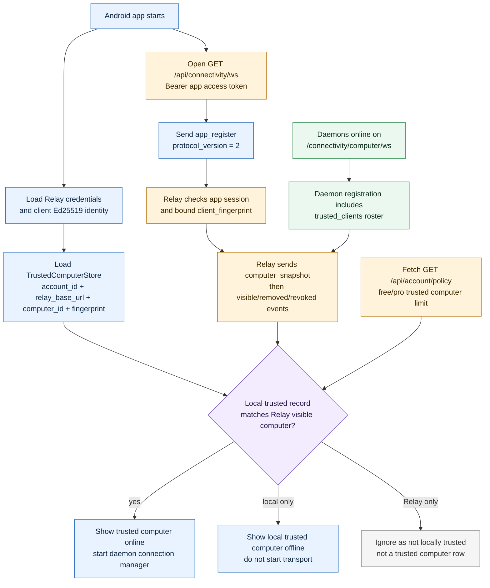
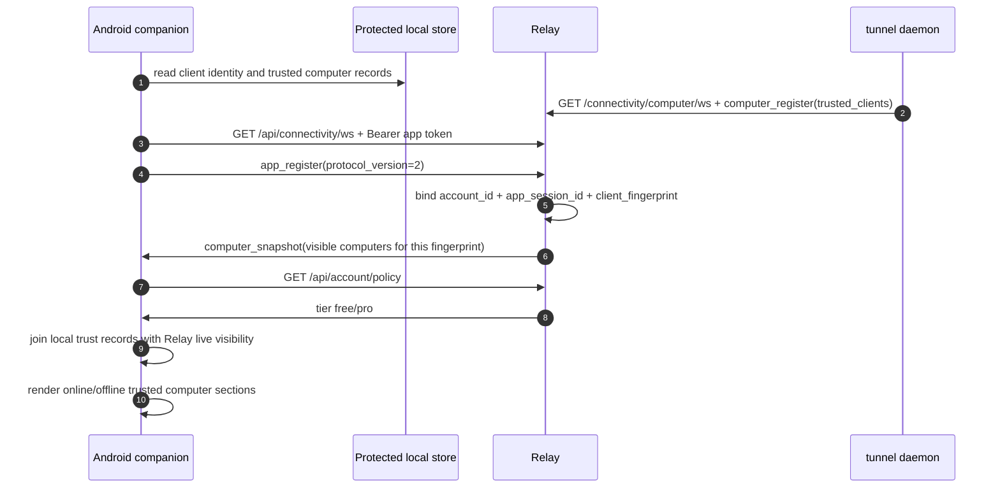

# 0. Computer List

这个图回答：用户打开 Android app 后，为什么能看到某些 computers，为什么有些本地信任过的 computers 会显示 offline，以及为什么 Relay presence 不能单独算 trusted。

## 状态来源

## Sequence

## 读图要点

- Android 的 trusted computer list 是 local trust + Relay live visibility + account policy 的 projection。
- Relay 只知道当前 online 且由 daemon registration 报告 trusted roster 的 computers。Relay 不保存 durable trusted computer database。
- 本地有 trusted record 但 Relay 没有 visible event，UI 可以展示 offline。
- Relay 有 visible computer 但本地没有 trusted record，Android 不能把它当 trusted computer，因为 app installation 没有本地 pinned daemon identity。
- `GET /api/computers` 是 remote launch control plane list，只表示 `/device/ws` online launchable computers；它不能替代 trusted computer list。

## 安全边界

Android 启动 daemon transport 前，必须确认：

- local trusted record 的 `computer_id` 和 `computer_fingerprint` 匹配 Relay visible computer。
- app session 绑定的 `client_fingerprint` 与本地 client public key 对应。
- account 和 Relay base URL 没有混用。

这些检查防止同 account 下的非信任 daemon、旧 app installation、或者错误 Relay environment 被误投影成同一台 trusted computer。
