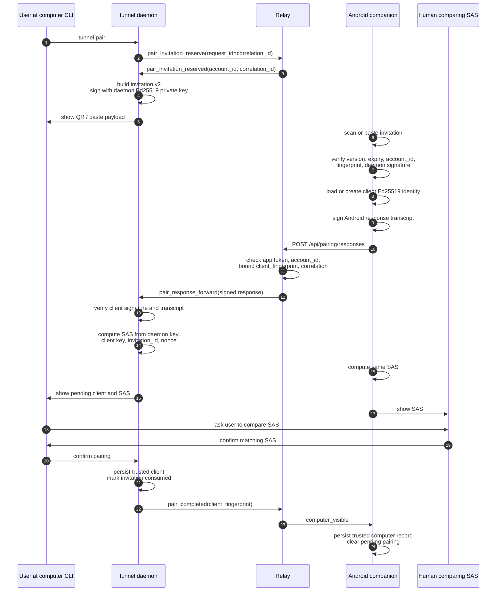
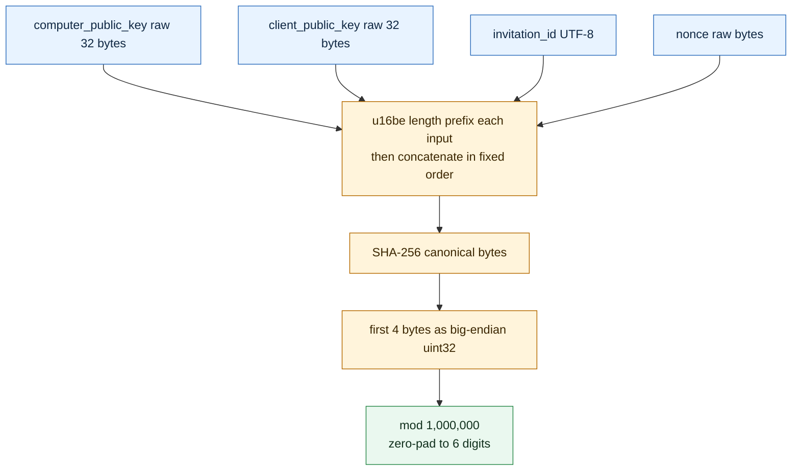

# 1. Pairing

Pairing 的目标是让一个 Android app installation 和一台 computer daemon 互相记住对方的 Ed25519 public key。Relay 只负责 account context 和消息转发，不是 trust root。

## 完整流程



## Transcript 和签名

```mermaid
flowchart LR
  classDef daemon fill:#eaf8ef,stroke:#2b8a4b,color:#102f1c
  classDef mobile fill:#e8f3ff,stroke:#2f6fbd,color:#0f2742
  classDef relay fill:#fff4db,stroke:#b66b00,color:#3b2600
  classDef verify fill:#f3ecff,stroke:#7557c2,color:#26164a

  DI[Daemon invitation transcript<br/>domain tunnel-pairing-invitation-v1<br/>account_id, computer_id, display_name,<br/>fingerprint, public_key, invitation_id,<br/>correlation_id, nonce, relay_base_url, expires_at]:::daemon
  DS[Ed25519 signature<br/>daemon private key]:::daemon
  AV[Android verifies daemon signature<br/>and fingerprint = SHA-256(public key)]:::verify

  AR[Android response transcript<br/>domain tunnel-pairing-android-response-v1<br/>account_id, invitation_id, correlation_id,<br/>client_fingerprint, client_public_key,<br/>client_display_name]:::mobile
  AS[Ed25519 signature<br/>client private key]:::mobile
  DV[Daemon verifies client signature<br/>and fingerprint = SHA-256(public key)]:::verify

  R[Relay forwards only<br/>cannot edit signed fields]:::relay

  DI --> DS --> AV
  AR --> AS --> R --> DV
```

## SAS 计算



## 为什么必须用户确认 SAS

Relay 可以验证 account 和 app session，但 Relay 不是 trust root。如果网络中间人或恶意 Relay 替换 public key，只要两端各自签了不同 transcript，signature verification 仍只能证明“某个 key 的 private key 存在”，不能证明两端看见的是同一组 key。

SAS 把 daemon key、client key、invitation id、nonce 放进同一个 hash。用户在电脑和手机上看到同一个 6 位数字，才说明两端看到的是同一组 pairing material。

## Pairing 完成后的存储

Daemon local state 保存：

- daemon Ed25519 connectivity identity。
- pending invitation 和 pending response。
- trusted Android client public key/fingerprint。
- revoked client records。

Android protected local storage 保存：

- client Ed25519 identity。
- pending pairing record。
- trusted computer record。
- Relay credentials。

Relay 只保存 live correlation 和 live visibility。Relay 重启、daemon 重连后，visible computer 由 daemon registration 的 `trusted_clients` roster 重建。

## 卸载 App 后为什么要重新 pairing

卸载 Android app 会删除 app-local protected storage：

- client private key 消失。
- trusted computer record 消失。
- Relay app session credentials 消失。

Daemon 可能仍然记得旧 `client_fingerprint`，但新安装的 app 没有对应 private key，无法完成 pinned QUIC/TLS handshake，也无法证明自己是旧 client。重新 pairing 会创建新的 client identity，并让 daemon trust roster 更新到新的 fingerprint。
