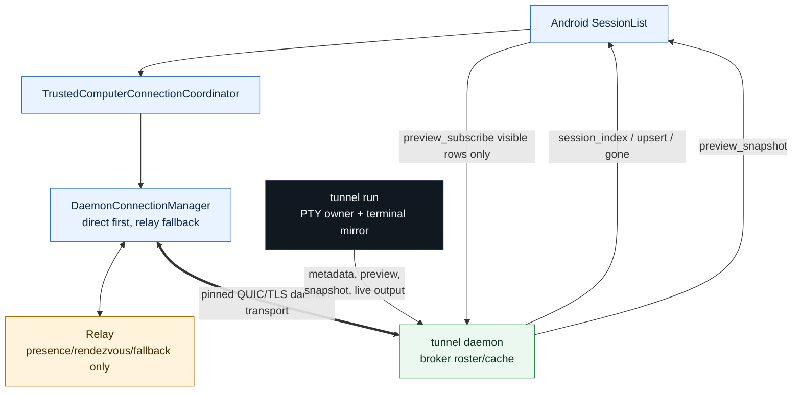
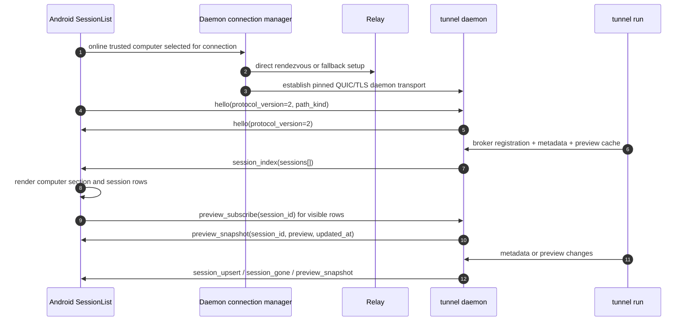
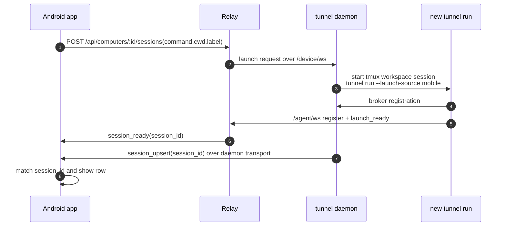

# 2. Session List And Preview

Pairing 之后，Android 上的 session list 和 recent output preview 来自 daemon transport，不来自 Relay session API。

## 数据流

## Sequence

## 关键事实

- Relay 没有 current session list API。
- Relay 不保存 preview，也不从 terminal output 里生成 preview。
- `session_index` 是 daemon 对当前 computer mobile-visible session set 的完整同步。
- `session_upsert` 是完整 replacement metadata object，不是 partial patch。
- `preview_snapshot` 和 session metadata 分开传，避免 metadata 改动和 preview 文本互相阻塞。
- Android 只订阅 visible rows 的 preview，减少 daemon transport traffic。

## SessionMetadata 边界

`SessionMetadata` 当前包含：

- `session_id`
- `label`
- `command_preview`
- `cwd`
- `git_branch`
- `started_at`
- `updated_at`
- `online`

它不包含：

- terminal snapshot bytes。
- live terminal bytes。
- preview text payload。
- account tier。
- Relay launch correlation fields。
- direct/fallback path authority。

## Launch 后如何收敛到 list

Mobile launch 是两段式：

`session_ready` 只说明 Relay launch correlation 完成。Android 仍要等 daemon transport 的 `session_upsert` 或下一次 `session_index` 才能显示真正可交互的 session row。

## Preview 的 UX 名称

UI 中这个区域应叫 `recent output preview`。它是 daemon broker 提供的 bounded latest preview，不是 chat message，也不是 Relay last message。
