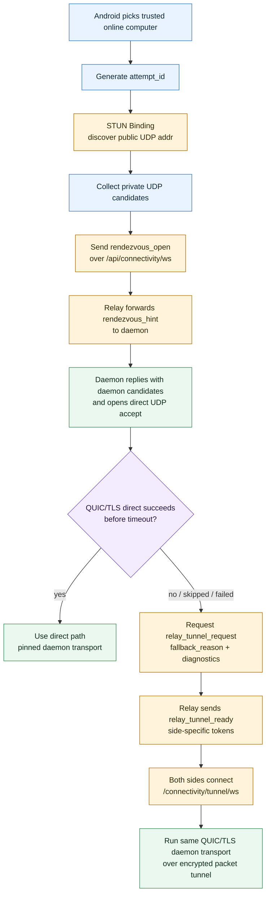
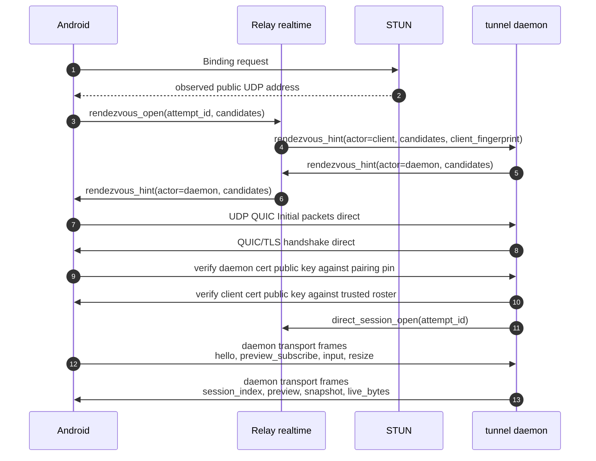
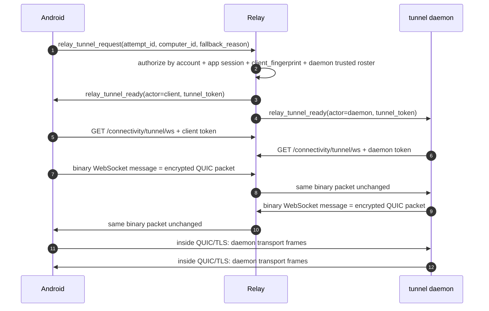

# 3. Direct And Relay Data Flow

Direct 和 Relay fallback 都承载同一套 daemon transport。区别只在 QUIC packet 怎么到达对端。

## Direct-first path selection

## Direct data flow

Relay 在 direct path 里只看到 rendezvous hints 和 authorization lifecycle event。Relay 看不到 QUIC payload。

## Relay fallback data flow

Fallback 的 Relay WebSocket 只承载 binary QUIC packets。Relay 不解析：

- QUIC。
- TLS。
- daemon transport frame。
- session metadata。
- preview。
- terminal snapshot/live bytes。
- input/resize。

## Carrier 对比

| 项目 | Direct | Relay fallback |
|---|---|---|
| Packet carrier | UDP between Android and daemon | WebSocket binary packets through Relay |
| Relay 可见内容 | rendezvous hints, lifecycle events | tunnel setup metadata, encrypted QUIC packets |
| TLS identity | pairing-pinned Ed25519 certs | same |
| ALPN | `tunnel-conn/1` | same |
| daemon transport frame registry | same | same |
| terminal plaintext | endpoint only | endpoint only |
| security model | pinned peer identity + fresh TLS keys | same |
| UX difference | lower latency when reachable | works when direct UDP cannot connect |

## 失败和降级

Android 可以进入 Relay fallback 的原因包括：

- direct skipped because no usable candidates。
- direct timeout。
- QUIC handshake failed。
- authorization superseded by newer attempt。
- network path temporarily unavailable。

Relay 会在这些情况清理 live state：

- attempt expired。
- app logout。
- password change revokes app sessions。
- agent token revoked。
- daemon disconnect。
- user deleted。
- trusted client revoked。
- newer attempt supersedes older attempt。

清理 live state 不代表 Relay 获得 terminal plaintext。已经建立的 direct transport 也要受 daemon-side authorization lifecycle 约束；daemon 收到 `direct_session_close` 或发现 authorization socket gone 后应关闭对应 direct transport。
