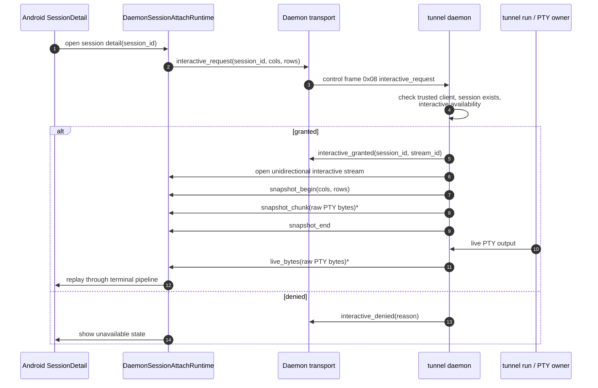
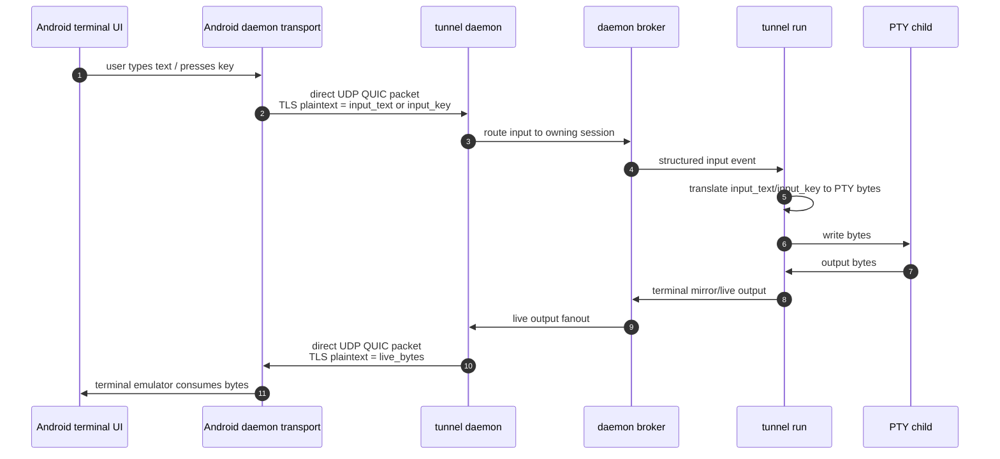
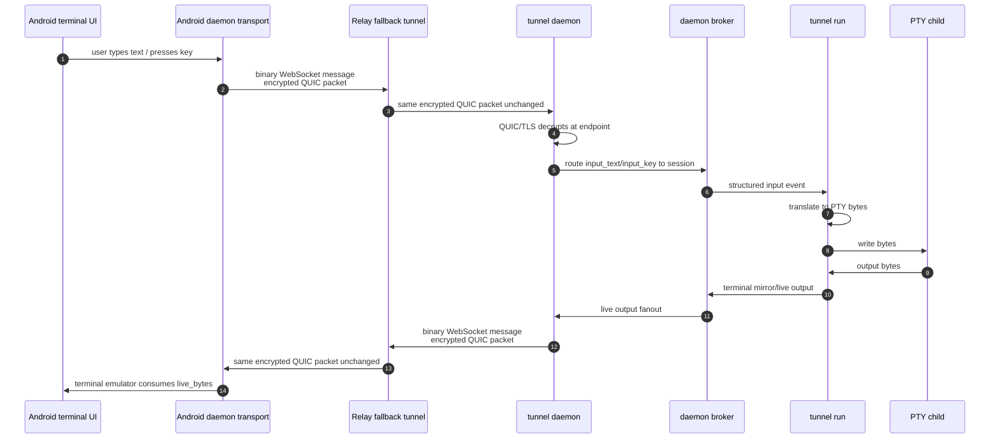

# 4. Detail Input

进入 SessionDetail 后，Android 看到的是 daemon transport 上的 interactive session。Direct 和 Relay fallback 下，interactive frames 完全相同。

## SessionDetail attach

## Input under direct path

## Input under Relay fallback path

## Control frames involved

| Action | Frame | Direction | Payload |
|---|---|---|---|
| attach request | `interactive_request` (`0x08`) | mobile -> daemon | `session_id`, `cols`, `rows` |
| attach accepted | `interactive_granted` (`0x09`) | daemon -> mobile | `session_id`, `interactive_stream_id`, `cols`, `rows` |
| attach rejected | `interactive_denied` (`0x0a`) | daemon -> mobile | `session_id`, `reason` |
| release | `interactive_release` (`0x0b`) | mobile -> daemon | `session_id` |
| text input | `input_text` (`0x0c`) | mobile -> daemon | `session_id`, `text`, optional `submit` |
| key input | `input_key` (`0x0d`) | mobile -> daemon | `session_id`, `key` |
| resize | `resize` (`0x0e`) | mobile -> daemon | `session_id`, `cols`, `rows` |
| snapshot start | `snapshot_begin` (`0x10`) | daemon -> mobile | `session_id`, `cols`, `rows` |
| snapshot body | `snapshot_chunk` (`0x11`) | daemon -> mobile | raw PTY bytes |
| live output | `live_bytes` (`0x12`) | daemon -> mobile | raw PTY bytes |
| snapshot end | `snapshot_end` (`0x13`) | daemon -> mobile | optional counters |

## Input 语义

`input_text` 用于：

- normal typing。
- pasted text。
- IME committed text。
- explicit submit。`submit: true` 表示先写 `text`，再写和 `ENTER` 相同的 carriage return semantics。

`input_key` 只用于 special keys，例如 Enter、Backspace、Tab、arrow keys、Escape 等。

`tunnel run` 是最终 PTY owner。Daemon broker 只 route structured input，真正的 PTY bytes translation 在 owning `tunnel run` 里完成。

## Resize 状态

Protocol 支持 `resize` frame。当前 Android detail behavior 是：

- initial terminal geometry 随 `interactive_request` 发送。
- text/key input 通过 daemon transport control stream 发送。
- live geometry update 不能写成已实现，除非 Android UI path 已经把 terminal geometry changes wired 到 `resize`。

这条边界很重要，因为“协议支持”和“当前 Android UI 已接线”不是同一件事。

## 安全边界

Direct 和 Relay fallback 下，SessionDetail 的安全模型一样：

- Android 和 daemon 都验证对方 TLS certificate public key 是否等于 pairing pin。
- Relay fallback 只看到 encrypted QUIC packets。
- Relay 不能 forge `input_text`，因为它没有 daemon transport TLS endpoint private key。
- Relay 不能读取 `live_bytes`，因为 terminal bytes 在 QUIC/TLS endpoint 内才解密。
- Daemon 必须在每次 interactive request 时重新检查 session availability 和 trusted client。
