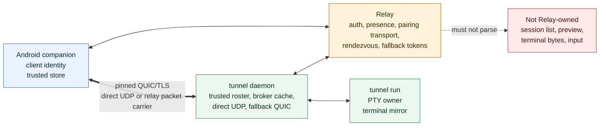

# Draws

这里集中放 Agent Tunnel connectivity 的流程图。文字版 SSOT 在上一层文档里；这里用 Mermaid 把关键路径画出来，方便快速建立全局模型。

建议阅读顺序：

1. [0. Computer List](00-computer-list.md)
2. [1. Pairing](01-pairing.md)
3. [2. Session List And Preview](02-session-list-preview.md)
4. [3. Direct And Relay](03-direct-relay-data-flow.md)
5. [4. Detail Input](04-detail-input.md)

这些图的边界：

- 图里的 Relay 是 authentication/control/routing plane。
- 图里的 daemon transport 是 pinned QUIC/TLS session。
- Relay fallback 图中经过 Relay 的内容是 encrypted QUIC packets，不是 terminal plaintext。
- Android 本地 storage 和 daemon 本地 storage 都是 trust boundary 的一部分，不是 UI cache。

## 总览

