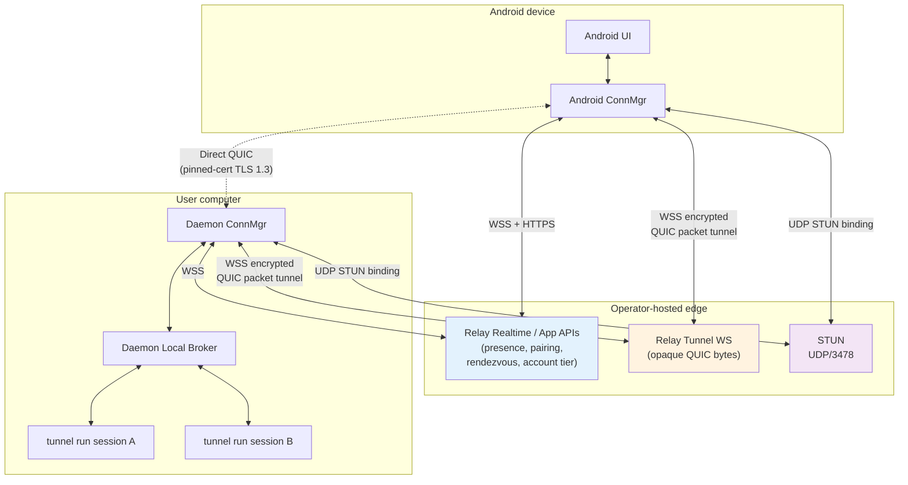

# QUIC Session Connectivity Architecture

> Legacy status: historical copy from `agent-tunnel`. This file is not current protocol authority. Use `docs/api.md`, `docs/architecture.md`, `docs/pairing.md`, `docs/relay-control-plane.md`, `docs/protocol.md`, and `docs/end-to-end-flows.md` in this repository for current SSOT.

## Status

This document records this repository's older architecture mirror for direct session connectivity. Current cross-repository architecture, API details, and flow diagrams live in [yuanbohan/agent-tunnel-protocols](https://github.com/yuanbohan/agent-tunnel-protocols), especially `../agent-tunnel-protocols/docs/architecture.md`, `../agent-tunnel-protocols/docs/api.md`, and `../agent-tunnel-protocols/docs/draws/README.md`. The Go repository now implements server-side/STUN, Relay rendezvous, daemon-side direct path, direct-first behavior, and Relay fallback proof points.

For this repository's phase-1 implementation contract, see `contract.md`. When this document and `contract.md` disagree, `contract.md` wins.

Use this document together with:

- `contract.md` — phase-1 contract and sub-phase gates
- `protocol/pairing.md`
- `protocol/transport.md`
- `protocol/relay.md`
- `protocol/local-broker.md`
- `ux/android.md`
- `ux/subscription.md`
- `reference/state-machines.md`
- `reference/sequence-flows.md`
- `reference/error-codes.md`
- `reference/decision-record.md`

## Component Overview

The diagram shows the three deployment edges (Android, operator-hosted edge, user computer) and the four communication carriers between them: Relay control plane, STUN, direct QUIC over UDP, and Relay Tunnel fallback carrying opaque QUIC packets.

State machines for transport lifecycle, per-session UI lifecycle, and trusted-computer policy evaluation live in `reference/state-machines.md`.

## Goals

- Prefer direct mobile-to-daemon connectivity for session traffic.
- Keep terminal payload end-to-end encrypted on both direct and fallback paths.
- Reduce Relay to account, presence, pairing transport, policy exposure, rendezvous, and fallback packet relay.
- Keep `tunnel run` as the real PTY owner and session owner.
- Keep the phase-1 Free / Pro product rule limited to trusted-computer count.

## Non-Goals

- No device-wide VPN or machine overlay.
- No Relay-resident session index in the target design.
- No plaintext preview or terminal content in Relay.
- No dependency on WebRTC, coturn, or SDP/ICE negotiation.
- No daemon-side tier branching in phase 1.
- No session-level Free / Pro gates in phase 1.

## System Shape

The system is split into five concerns:

1. Account tier and trusted-computer policy
2. Device trust and pairing
3. Relay rendezvous and fallback
4. Local session ownership and daemon brokering
5. End-to-end session transport

### 1. Account Tier And Trusted-Computer Policy

The account system remains because it solves:

- app login
- account tier lookup
- multiple phones and multiple computers under one identity
- Relay authorization for daemon presence, pairing transport, and fallback usage

In phase 1:

- Relay tells the official app whether the account is `free` or `pro`
- Relay does not choose one session for the account
- Relay does not issue per-session access tokens
- Relay does not fan out per-session authorization to daemons

The phase-1 Free / Pro difference is therefore an official-app product rule, not a daemon-enforced capability system.

### 2. Device Trust And Pairing

Each daemon and each Android app installation owns one long-lived device key.

Pairing rules:

- Android must already be logged in
- same-account devices are not automatically trusted
- trust is daemon-scoped
- `tunnel pair` reserves a live Relay correlation, receives the authenticated account id, creates a short-lived one-time invitation, and drives SAS confirmation in one CLI flow
- forwarded Android responses remain pending until local SAS confirmation
- the daemon is the trust root for device approval
- Relay may carry pairing messages, but it does not decide trust
- both sides persist the other side's public-key fingerprint locally after successful pairing

The pairing contract is specified in `protocol/pairing.md`.

### 3. Relay Rendezvous And Fallback

Relay remains in the system, but its role is narrower.

Relay is responsible for:

- account authentication
- account tier exposure to the official app
- daemon presence
- pairing request and response transport
- rendezvous hint exchange for direct connection attempts
- fallback packet relay over WebSocket-over-HTTPS

Relay is not responsible for:

- session discovery authority
- preview generation
- interactive grant / deny decisions
- terminal byte routing semantics
- payload decryption
- per-session tier enforcement in phase 1

### 4. Local Session Ownership And Daemon Brokering

`tunnel run` remains the real session owner.

That means:

- `tunnel run` still owns the PTY
- `tunnel run` still owns the live terminal mirror
- `tunnel run` remains the source of session metadata, preview, and interactive bytes

The daemon is not the PTY owner. In this architecture it acts as:

- the mobile transport endpoint
- the local session directory exposed to mobile clients
- the local broker that forwards preview / interactive requests to the owning `tunnel run`

This keeps the user-facing startup model stable:

- users still launch sessions with `tunnel run`
- daemon exists to make those sessions reachable from mobile, not to replace `tunnel run`

Phase-1 local coordination uses explicit registration from each `tunnel run` into the daemon over a long-lived local connection. The detailed contract lives in `protocol/local-broker.md`.

The architectural rule is the important part:

- **daemon brokers**
- **`tunnel run` owns the session**

### 5. End-To-End Session Transport

After pairing, Android and the daemon connect over one authenticated, encrypted transport per daemon.

Transport rules:

- direct path: QUIC over UDP
- fallback path: QUIC packets tunneled through Relay over WebSocket-over-HTTPS
- the same daemon-side session protocol runs on either path
- Relay only sees encrypted transport packets on the fallback path

The transport contract is specified in `protocol/transport.md`.

## Tier Product Rule

Phase 1 chooses the simplest viable product rule (`contract.md` D3, full detail in `ux/subscription.md`):

- `free` may keep at most one active trusted computer
- `pro` may keep up to ten trusted computers
- within one active trusted computer, Free and Pro session behavior is identical

Android owns local trusted-computer state and decides which daemon transports to open. Relay exposes only `tier`; daemon and Relay do not store active computer selection or selected session rows.

Implications:

- Free auto-connects the one active online trusted computer
- Free changes computers through transactional Replace Computer
- Pro auto-connects all online trusted computers up to ten
- Pro downgrade to Free requires the user to choose one active computer before multi-computer auto-connect resumes
- all session rows inside an active computer remain visible, previewable, and attachable

This is a deliberate simplicity tradeoff:

- the official app enforces the product rule
- daemon does not enforce it
- modified clients with daemon trust could ignore the computer-count rule

That tradeoff is accepted in phase 1 because the product is still pre-launch and the simpler design materially lowers implementation risk.

To keep phase-1 client behavior simple, tier decides computer connections, not per-session UI. Phase 1 does not need per-session entitlement tokens or preview gates.

## Security Model

### Transport Security

The selected security model is:

- QUIC with TLS 1.3 session encryption
- peer verification by pinned device public-key fingerprint
- no public CA trust requirement
- no second application-layer encryption envelope in phase 1

The product requirement is not "use Noise" by name. The requirement is:

- device-authenticated end-to-end encryption
- Relay cannot read terminal payloads
- direct and fallback paths share one security model

This design should be described as:

- `QUIC/TLS 1.3 + device-key pinning`

not:

- `WebRTC`
- `WireGuard`
- `Noise-IK over QUIC`

### Cryptographic Building Blocks

The architecture should be understood as two different key layers:

1. long-lived device identity keys
2. per-connection session keys

The current preferred direction is:

- device identity and pairing signatures: `Ed25519`
- TLS 1.3 ephemeral key exchange: `X25519` or implementation-selected TLS 1.3 ECDHE group
- key derivation: `HKDF`
- packet encryption: TLS 1.3 AEAD such as `AES-GCM` or `ChaCha20-Poly1305`

The exact negotiated TLS cipher suite is an implementation detail, but the architectural rule is stable:

- pairing establishes who the peer is
- TLS 1.3 establishes fresh symmetric keys for this connection
- terminal payload is encrypted only with the per-connection session keys, not with the long-lived device identity keys directly

### Why Pairing And Transport Are Separate

Pairing answers:

- who is this device
- do I trust this device

QUIC/TLS answers:

- can this peer prove it owns the trusted device identity
- what fresh symmetric keys should protect this connection

That split is important because:

- compromising a long-lived identity key should not automatically decrypt old transport captures
- transport encryption should rotate naturally per connection
- Relay should never participate in session-key derivation

### Pairing Confirmation

Pairing includes a human-visible 6-digit SAS derived from both device identities and the current invitation context. Users confirm that both screens show the same number before trust is finalized.

This closes the remaining "Relay swapped keys during pairing transport" class of attack without introducing a heavyweight UX.

### Threat Model Summary

| Threat | Defense | Residual Risk |
|---|---|---|
| Relay reads terminal bytes | QUIC + TLS 1.3 with peer cert pinned to device key from pairing | None |
| Relay or network attacker substitutes TLS keys to MITM the transport | Public-key pinning at the QUIC/TLS layer; cert chain validation is bypassed and only SubjectPublicKeyInfo equality is checked | None |
| Relay swaps device keys during pairing transport | 6-digit SAS confirmed by the user on both screens before trust is finalized | User must actively confirm |
| Relay tampers with rendezvous candidates | Inner QUIC/TLS handshake will fail against a wrong endpoint; cert pinning catches the substitution | Relay can force-downgrade the path from direct to fallback; confidentiality is preserved on either path |
| Network attacker captures past traffic and later steals the long-lived device key | TLS 1.3 ECDHE per connection provides forward secrecy on session keys | Past sessions remain secret; future sessions can be impersonated until the affected key is revoked |
| Invitation payload is observed by a bystander | Invitation is one-time, expires quickly, and is bound to a specific Android device key by signature | Invitation alone cannot pair an attacker's device |
| Pairing response is replayed by Relay | Invitation is single-use; reuse fails closed | None |
| Daemon device key is exfiltrated from the host | User must revoke and re-pair devices operationally | No in-band automatic recovery in phase 1 |
| Android device key is stolen with the device | Daemon-side revoke removes trust and terminates active transport | Brief in-flight packets may still arrive until close propagates |

### Acknowledged Downgrade Capability

Relay sits in the path that exchanges rendezvous hints and authorizes fallback tunnels. A misbehaving Relay can therefore:

- prevent direct connection attempts from succeeding by manipulating or withholding rendezvous hints
- force the connection to use the fallback relay tunnel

It cannot, however, decrypt either path because both terminate inside the daemon and Android with pinned device identities. The product accepts this downgrade capability as the price of using Relay for rendezvous.

## Session UX Implications

The user-visible session experience is intentionally split:

- Relay makes daemon cards visible
- daemon transport makes session rows visible
- preview appears only after app subscription
- interactive appears only after app request and daemon grant

In the official app:

- Free and Pro users see the same row behavior inside an active trusted computer
- preview appears for rows the app subscribes to
- interactive appears after app request and daemon grant
- tier affects which trusted computers may be connected, not which session rows are usable

This keeps the product understandable without reintroducing Relay-owned per-session authorization.

## References

- `contract.md`
- `protocol/relay.md`
- `protocol/transport.md`
- `protocol/pairing.md`
- `protocol/local-broker.md`
- `ux/android.md`
- `ux/subscription.md`
- `reference/sequence-flows.md`
- `reference/state-machines.md`
- `reference/error-codes.md`
- `reference/decision-record.md`
