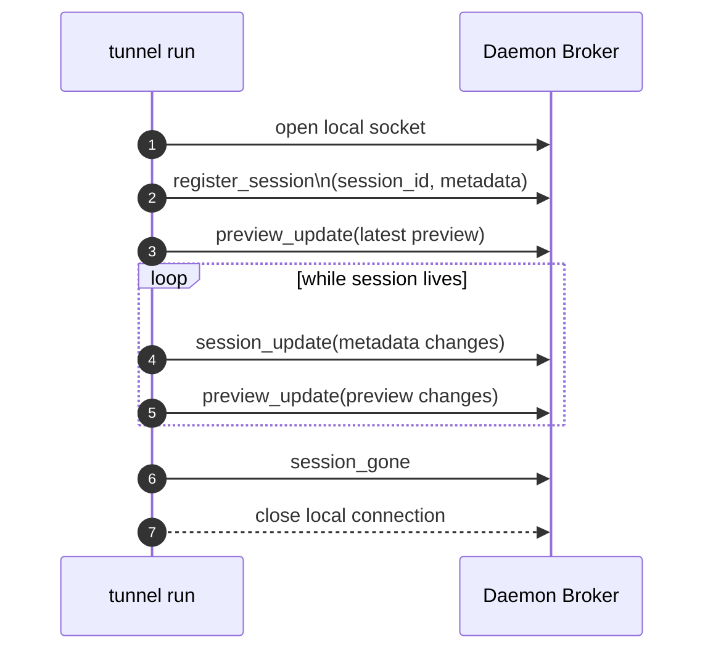
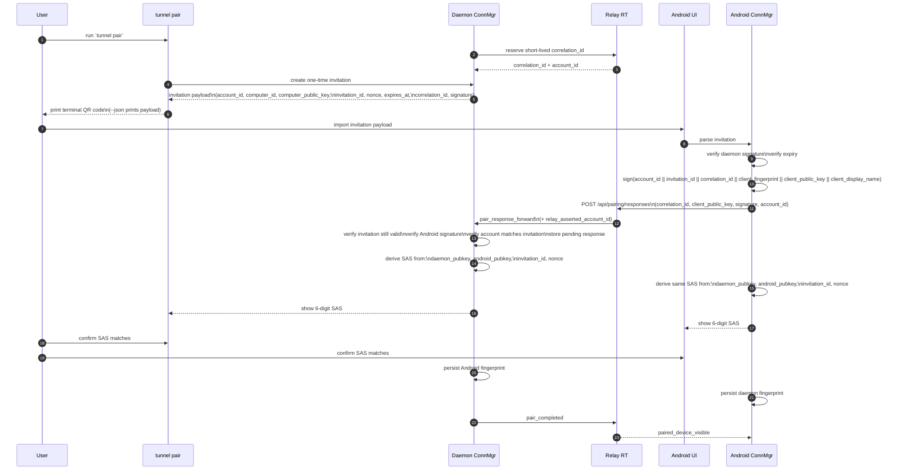
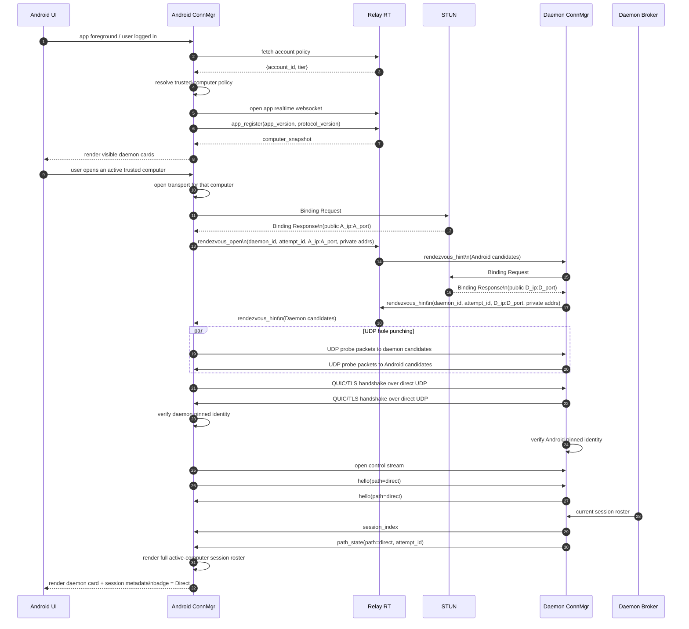
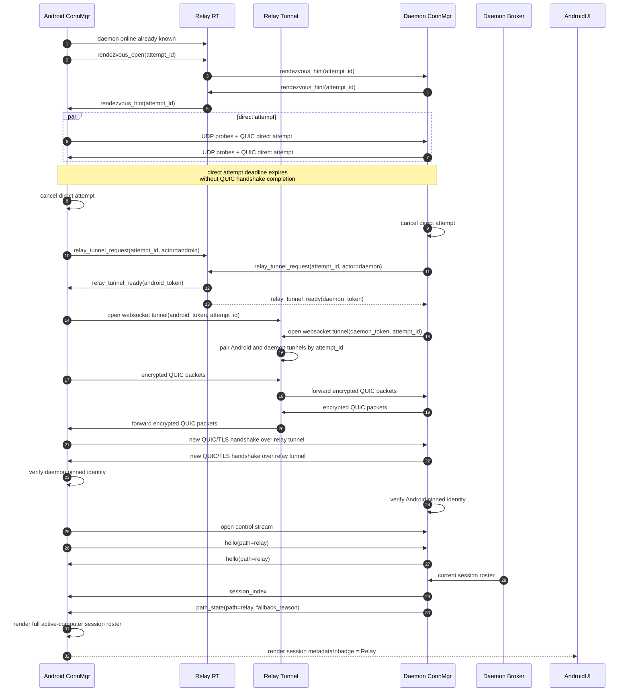
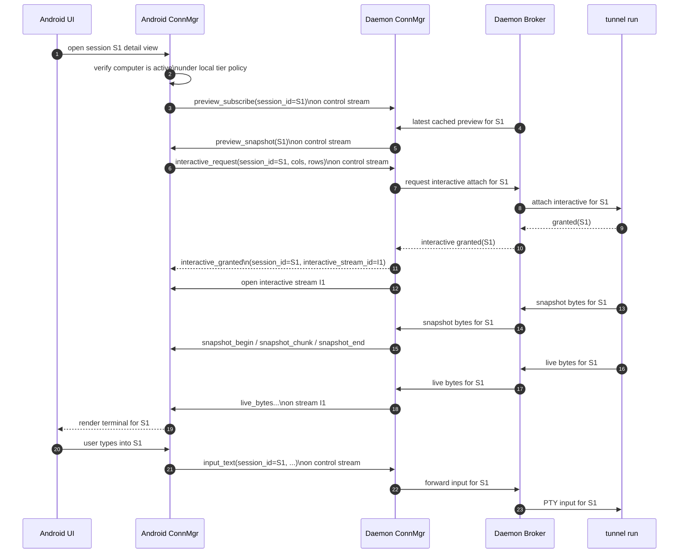
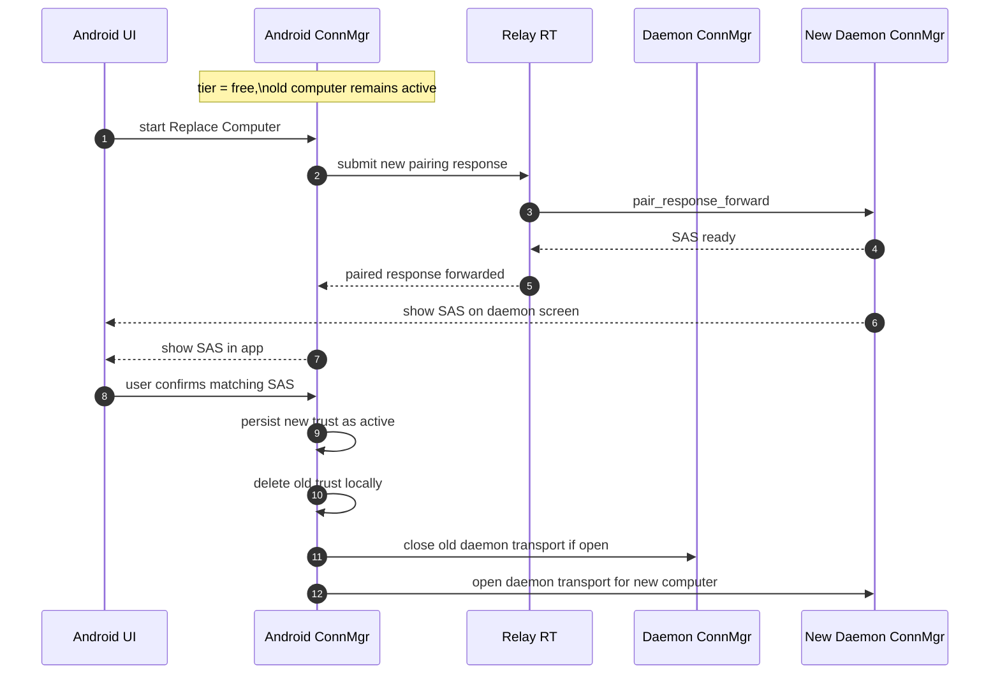
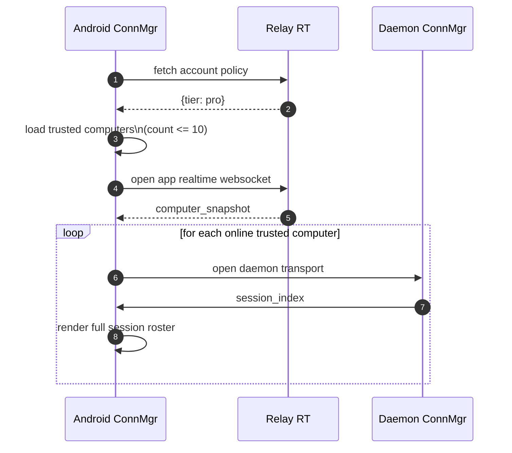
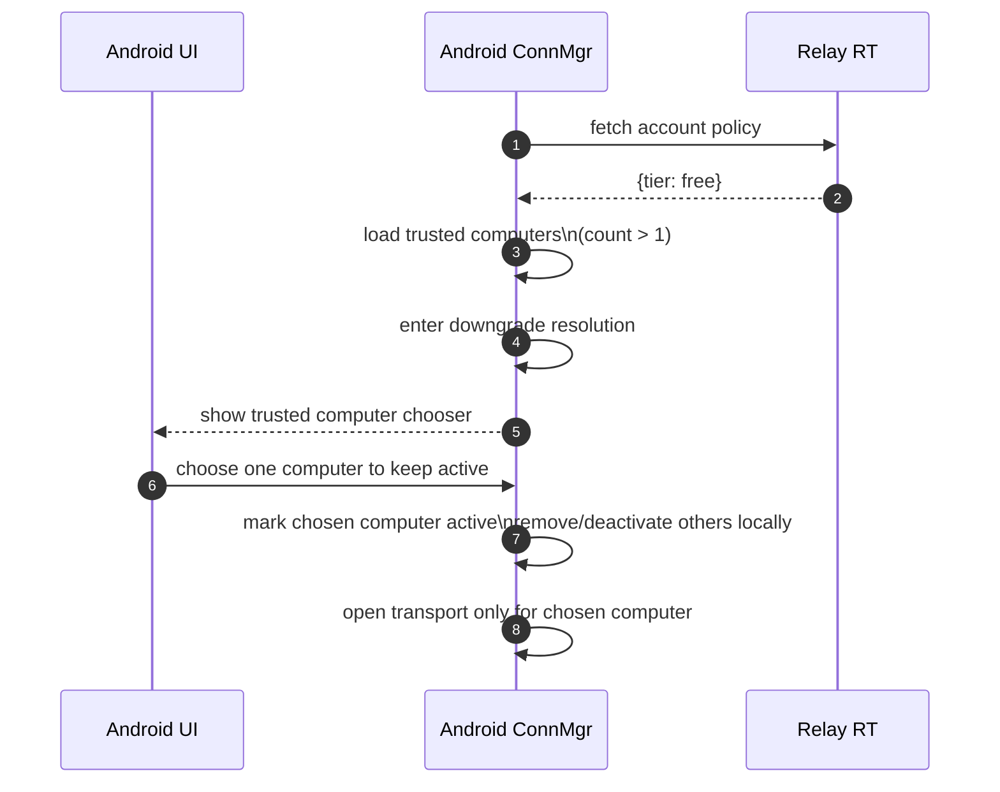
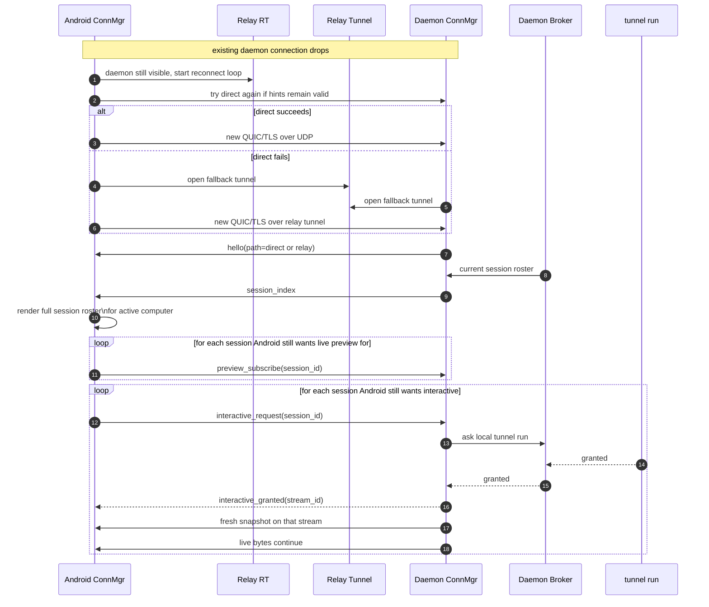

# Connectivity Sequence Flows

> Legacy status: historical copy from `agent-tunnel`. This file is not current protocol authority. Use `docs/api.md`, `docs/architecture.md`, `docs/pairing.md`, `docs/relay-control-plane.md`, `docs/protocol.md`, and `docs/end-to-end-flows.md` in this repository for current SSOT.

## Status

This document captures detailed end-to-end sequence flows for the target connectivity architecture under `docs/connectivity/`.

It is intentionally more operational than `architecture.md`. Its purpose is to make the moving pieces easy to reason about before implementation:

- pairing
- SAS confirmation
- STUN-assisted direct connection attempts
- relay fallback tunnel establishment
- daemon-brokered session synchronization
- preview and interactive attach over QUIC streams

These flows describe the intended target design. They are not a statement that the current repository already implements them.

## Actors

The diagrams use these actors:

- `Android UI`: the visible mobile app screens and user actions
- `Android ConnMgr`: the mobile connectivity manager responsible for Relay control-plane and daemon transport
- `Relay RT`: Relay realtime control plane and app policy API surface
- `Relay Tunnel`: Relay fallback packet tunnel service
- `STUN`: self-hosted STUN service operated in the same edge footprint as Relay
- `Daemon ConnMgr`: daemon-side connectivity manager
- `Daemon Broker`: daemon-side local broker between mobile transport and local `tunnel run` sessions
- `tunnel run`: the local session owner that owns PTY, mirror, preview source, and interactive attach

## Flow 0: Local Session Registration

### What This Flow Shows

- every `tunnel run` explicitly registers itself with daemon
- the local connection lifetime is the primary liveness signal
- daemon keeps the latest preview cached even before any mobile preview subscription arrives

## Flow 1: Pairing Invitation And SAS Confirmation

### What This Flow Establishes

- Relay transports pairing messages but is not the trust root for device identity.
- The daemon-authored invitation is the initial device trust anchor.
- Android proves possession of its device key by signing the invitation challenge.
- Account binding is based on Relay assertion, and that assertion is bound into the signed pairing transcript.
- The 6-digit SAS gives the user a final MITM check.

## Flow 2: App Startup To Direct Connection Success

### What This Flow Shows

- Relay tells Android which daemons are visible and which account tier applies.
- Android uses tier with local trusted-computer state before opening daemon transport.
- STUN is only used to learn public UDP mappings.
- Relay carries rendezvous hints but never terminal data.
- daemon transport starts only for tier-allowed trusted computers
- Direct success means the daemon becomes the official mobile companion source of session roster and preview / interactive routing.
- Free and Pro session rows behave identically once the computer is active.

## Flow 3: Direct Attempt Fails And Falls Back To Relay

### What This Flow Shows

- Direct and relay are different carriers, not different business protocols.
- Fallback creates a new QUIC/TLS connection. It does not migrate the failed direct connection in place.
- Relay Tunnel forwards encrypted QUIC packets only.
- After fallback succeeds, daemon resends the session roster over the new connection.

## Flow 4: Preview And Interactive For Any Session In An Active Computer

### What This Flow Shows

- `tunnel run` remains the PTY owner.
- The daemon is a gateway and local broker, not the terminal owner.
- The official app asks for preview / interactive only after the computer is active.
- No Relay-issued per-session access token is involved in phase 1.

## Flow 5: Free Replace Computer

### What This Flow Shows

- Free replacement is transactional.
- The old computer remains active until new pairing SAS succeeds.
- If pairing fails, is canceled, or SAS mismatches, Android keeps the old trust active and does not switch computers.
- Phase 1 deletes old trust locally on Android only.
- TODO: add daemon-side old-trust revoke later.

## Flow 5B: Pro Multi-Computer Auto-Connect

### What This Flow Shows

- Pro scales the number of trusted computers, not per-session capability.
- Inside each connected computer, session rows behave the same as Free.
- If the user has ten trusted computers, new pairing is blocked until one is removed.

## Flow 5C: Pro Downgrade To Free Resolution

### What This Flow Shows

- Free never auto-connects multiple trusted computers.
- Downgrade resolution is required before multi-computer users continue on Free.
- The rule is computer-scoped; session rows behave identically after one computer is active.

## Flow 6: Reconnect And Fresh Recovery

### What This Flow Shows

- reconnect is path-agnostic
- recovery is based on fresh daemon state, not missed-byte replay
- preview and interactive are re-established from current app state after reconnect
- tier policy is applied before reconnecting computers, not while rebuilding individual session rows

## State Ownership Summary

### Android ConnMgr Owns

- app policy fetch
- app realtime websocket lifecycle
- per-daemon transport lifecycle
- local trusted-computer policy evaluation
- preview / interactive subscriptions the official app chooses to request

### Daemon ConnMgr Owns

- paired-device validation
- direct-vs-relay carrier selection
- QUIC/TLS transport lifecycle
- stream creation and routing

### Daemon Broker Owns

- local session directory
- accepting explicit local `register_session` connections from `tunnel run`
- caching the latest preview pushed by each owning `tunnel run`
- fanning cached preview updates to subscribed mobile clients
- forwarding interactive attach requests to the owning `tunnel run`
- bridging snapshot / live bytes / input between transport and local session owners

### `tunnel run` Owns

- PTY lifecycle
- mirror and preview source
- snapshot generation
- live terminal bytes
- terminal input handling

### Relay Owns

- account tier exposure to the official app
- daemon presence
- pairing transport
- rendezvous hint exchange
- fallback tunnel pairing

Relay does not own:

- session list
- preview content
- interactive grants
- terminal byte routing semantics

## Related Documents

- `../architecture.md`
- `../contract.md`
- `../protocol/pairing.md`
- `../protocol/relay.md`
- `../protocol/transport.md`
- `../protocol/local-broker.md`
- `../ux/android.md`
