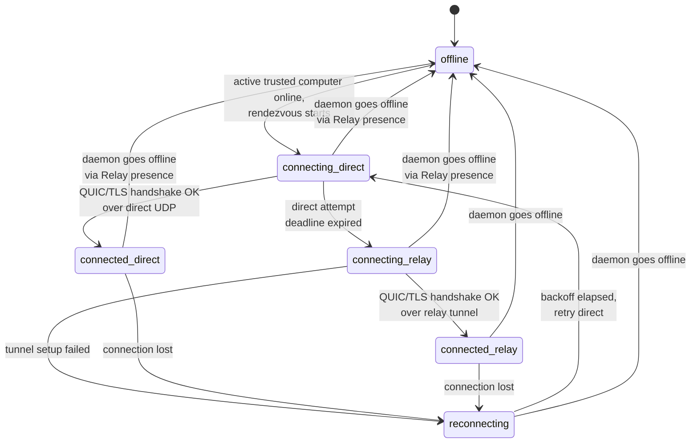
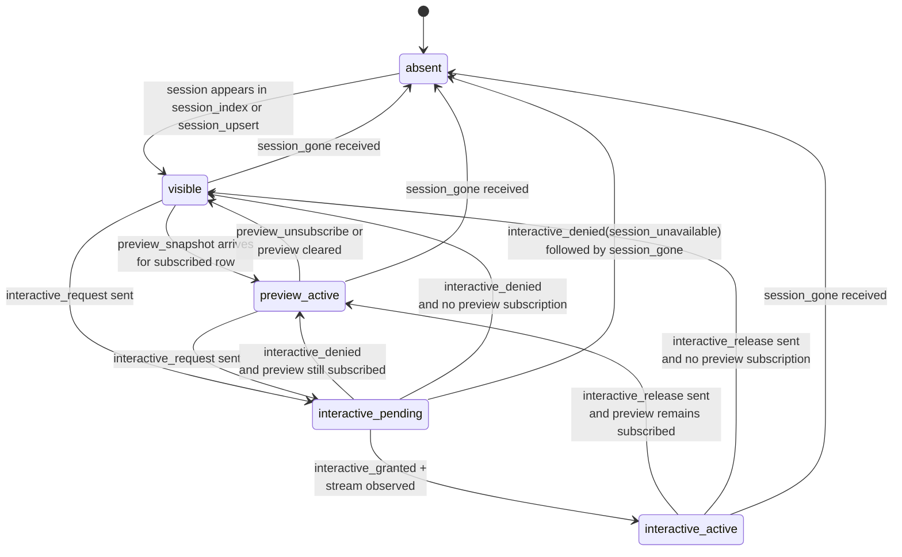
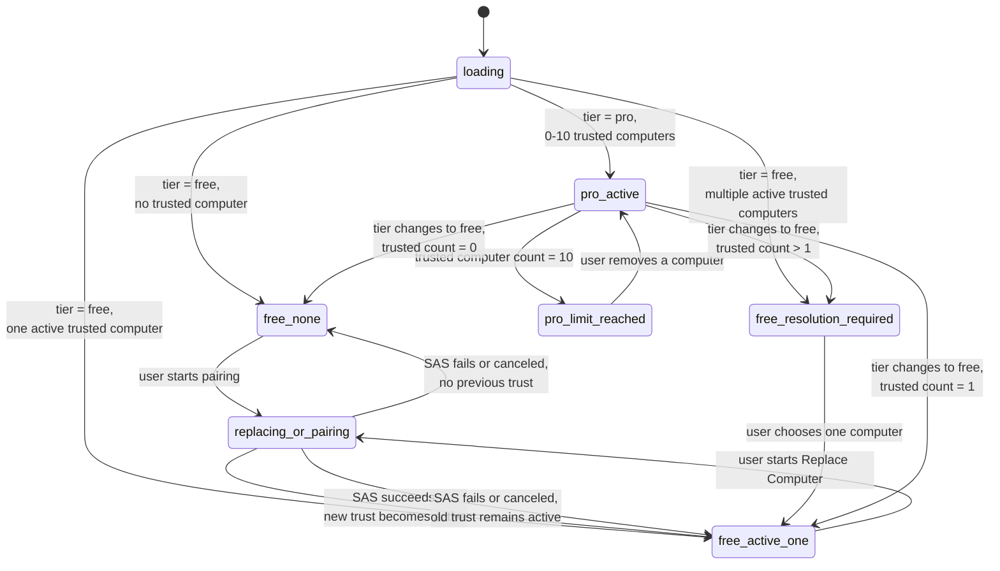

# Connectivity State Machines

> Legacy status: historical copy from `agent-tunnel`. This file is not current protocol authority. Use `docs/api.md`, `docs/architecture.md`, `docs/pairing.md`, `docs/relay-control-plane.md`, `docs/protocol.md`, and `docs/end-to-end-flows.md` in this repository for current SSOT.

## Status

This document collects the core state machines of the QUIC session-connectivity architecture. Tier policy is computer-scoped only; there is no per-session tier state. For the official mobile companion, per-session UI state is derived from daemon transport `session_index`, `session_upsert`, and `session_gone`, not Relay session list/detail/attach endpoints.

## Per-Daemon Transport State

This state is owned by the Android connection manager. Each daemon connection has one independent instance of this state machine. The state name is also surfaced in the UI as the computer-card status.

### Transition Rules

- `offline -> connecting_direct` happens only for a trusted computer the current tier allows Android to connect.
- `connecting_direct -> connecting_relay` is sequential, not happy-eyeballs; the deadline is an implementation default.
- `connecting_* -> offline` happens immediately if Relay presence marks the daemon offline before the transport finishes connecting.
- `reconnecting` uses exponential backoff with jitter.
- the path badge is derived from this state and confirmed by transport diagnostics: `connected_direct -> "Direct"`, `connected_relay -> "Relay"`, others -> status word.

### Daemon-Side Mirror

The daemon also maintains a per-Android-connection state, but once QUIC/TLS is accepted it treats direct and relay carriers identically and reports only advisory path diagnostics (`direct` or `relay`).

## Per-Session UI Lifecycle

This state is owned per `(computer, session)` pair on Android. Multiple sessions on the same daemon connection can each be in different states.

### State Meanings

- `absent` - the session is not currently present in the daemon roster.
- `visible` - the row is visible and usable in the official app because its computer is active.
- `preview_active` - the app subscribed to preview and is receiving live preview snapshots for this session.
- `interactive_pending` - the app sent `interactive_request` and is awaiting daemon response.
- `interactive_active` - daemon opened an interactive stream; snapshot and live bytes are flowing.

### Rules

- Free and Pro use the same per-session UI lifecycle once the computer is active.
- Android may choose which previews to subscribe to for performance or list UX, but not as a tier gate.
- `interactive_denied(session_unavailable)` should be followed by row removal once `session_gone` is processed.

### Daemon-Side Mirror

From the daemon's perspective, a paired device may:

- subscribe or unsubscribe preview for any session
- request interactive for any session
- receive grant / deny per session

The daemon does not model tier, active computer count, or selected sessions.

## Trusted-Computer Policy Lifecycle

This state is owned by the official Android app per account.

### Notes

- Relay provides only the tier input for this machine.
- Android local state provides trusted-computer inventory.
- Free auto-connects only the one active trusted computer.
- Pro auto-connects online trusted computers up to the ten-computer limit.
- Downgrade resolution blocks multi-computer auto-connect until the user chooses one active computer.
- Replace Computer is transactional: failed or canceled new pairing leaves the old active trust unchanged.
- TODO: add daemon-side old-trust revoke after Replace Computer success.

## Cross-Reference

- preview and interactive frame behavior are in `../protocol/transport.md`
- Free / Pro computer rules are described in `../ux/subscription.md`
- recommended Android behavior is in `../ux/android.md`

## Related Documents

- `../architecture.md`
- `../contract.md`
- `../protocol/transport.md`
- `../protocol/relay.md`
- `../ux/subscription.md`
- `error-codes.md`
- `sequence-flows.md`
